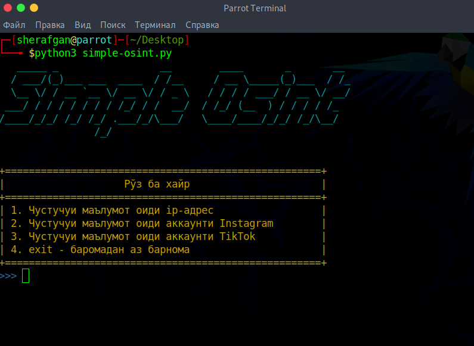

# 🔎 __Simple Osint__
#### ___Simple Osint скрипт для простого поиска___

<br>

### :scroll: Список команд
```text
1. Поиск информации IP-адреса
2. Поиск информации аккаунта Instagram
3. Поиск информации аккаунта TikTok
4. Выход из программы
```
### :computer: Инструкция по установке на Kali Linux / Parrot OS
```text
sudo apt install git python3 -y && sudo apt update -y && sudo apt upgrade -y && sudo apt autoremove -y 
git clone https://github.com/Sherafgan1001/SimpleOsint.git
cd SimpleOsint
pip install -r requirements.txt
python3 simple-osint.py
```
### :iphone: Инструкция по установке на Termux
```text
pkg update -y && pkg upgrade -y
pkg install git python3 -y
git clone https://github.com/Sherafgan1001/SimpleOsint.git
cd SimpleOsint
pip install -r requirements.txt
python3 simple-osint.py
``` 
### :iphone: Инструкция по установке на iShell (iPhone)
```text
apk update -y && apk upgrade -y
apk install git python3 py-pip -y
git clone https://github.com/Sherafgan1001/SimpleOsint.git
cd SimpleOsint
pip install -r requirements.txt
python3 simple-osint.py
```  
